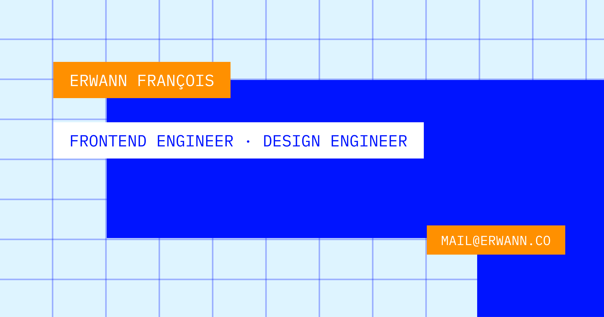

# erwann.co

Personal website of **Erwann François**, Frontend engineer / Design engineer.

Plain HTML, CSS and JavaScript. No framework, no build step, no dependencies. Design made in Figma.

## Stack

| | |
|---|---|
| Design | Figma |
| Fonts | [IBM Plex Mono](https://fonts.google.com/specimen/IBM+Plex+Mono) & [Inter](https://fonts.google.com/specimen/Inter), from Google Fonts |
| Hosting | Vercel |

## Credits

Company logos belong to their respective owners.
